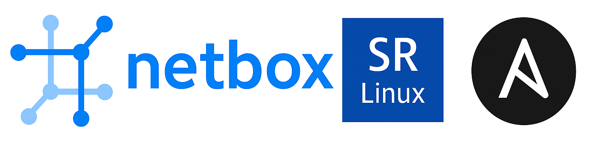

# SRLinux Netbox Demo with Ansible

<div align=center>
<a href="https://codespaces.new/srl-labs/srl-netbox-demo?quickstart=1">
</a>
</div>

This lab builds a demo fabric of Nokia SR Linux devices with NetBox 4.4.6 and Ansible. Containerlab spins up the topology, NetBox is populated with Nokia device types, and playbooks from the [netbox_integration_example branch](https://github.com/srl-labs/intent-based-ansible-lab/tree/netbox_integration_example) of `intent-based-ansible-lab` generate and deploy intents.


---
<div align=center>
<a href="https://codespaces.new/srl-labs/srl-netbox-demo?quickstart=1">
</a>

**[Run](https://codespaces.new/srl-labs/srl-netbox-demo?quickstart=1) this lab in GitHub Codespaces for free**.  
[Learn more](https://containerlab.dev/manual/codespaces/) about Containerlab for Codespaces.

</div>

---

## Choose how to run

- **Codespaces:** click the button above and wait for the devcontainer to finish. Everything below is run from the repo root inside Codespaces.
- **Local machine:** follow the prerequisites and setup below, then run the same workflow.

## Local prerequisites

1) Containerlab installed. See the [official docs](https://containerlab.srlinux.dev/install/).
2) Git, Docker, and uv.

> [!TIP]
> **Why uv?**
> [uv](https://docs.astral.sh/uv) is a single, ultra-fast tool that can replace `pip`, `pipx`, `virtualenv`, `pip-tools`, `poetry`, and more. It automatically manages Python versions, handles ephemeral or persistent virtual environments (`uv venv`), lockfiles, and often runs **10–100× faster** than pip installs.

## Local setup

```bash
git clone --recursive https://github.com/srl-labs/srl-netbox-demo
cd srl-netbox-demo

# Install uv (Linux/macOS)
curl -LsSf https://astral.sh/uv/install.sh | sh

# Install the Nokia SR Linux Ansible collection
uv run ansible-galaxy collection install nokia.srlinux
```

> [!IMPORTANT]
> Use `--recursive` because `intent-based-ansible-lab` is a submodule.

## Run book (Codespaces or local)

All commands run from the repo root. Replace the NetBox URL step with the Codespaces forwarded port if you are in Codespaces.

1. **Deploy the topology**

    

    ```bash
    clab deploy -t srl_netbox.clab.yaml
    ```
    - Spins up NetBox and the SR Linux fabric; expect ~4–5 minutes.
    - Watch progress: `docker logs -f netbox`
    - Wait until netbox_importer get healthy

2. **Open NetBox**
    - Local: `http://127.0.0.1:8000` (user/pass `admin` / `admin`).
    - Codespaces: open forwarded port 8000 in the Ports panel.

3. **Initialize NetBox data**
    ```bash
    bash api_scripts/import_infra.sh      # imports device types, CFs, infrastructure intents
    bash api_scripts/import_service.sh    # imports L2/L3 VPN services
    ```

4. **Generate Ansible intents from NetBox**
    ```bash
    INTENT_DIR=$(pwd)/intents/generated_intents
    uv run ansible-playbook -i inv/ -e intent_dir=$INTENT_DIR \
      intent-based-ansible-lab/playbooks/netbox_generate_intents.yml --diff
    ```

5. **Deploy the generated intents**
    ```bash
    uv run ansible-playbook -i inv -e intent_dir=$INTENT_DIR \
      intent-based-ansible-lab/playbooks/cf_fabric.yml --diff
    ```

6. **(Optional) Verify with fcli**
    ```bash
    CLAB_TOPO=srl_netbox.clab.yaml
    alias fcli="docker run -t --network $(grep '^name:' $CLAB_TOPO | awk '{print $2}') --rm \
      -v /etc/hosts:/etc/hosts:ro -v ${PWD}/${CLAB_TOPO}:/topo.yml \
      ghcr.io/srl-labs/nornir-srl:latest -t /topo.yml"

    fcli ni
    ```

7. **Tear down when done**
    ```bash
    clab destroy -t srl_netbox.clab.yaml
    ```

## Troubleshooting

- Containerlab bring-up can take several minutes; rerun `docker ps` and `docker logs -f netbox` to verify health.
- Make sure firewall/proxy rules allow the container connectivity defined in the topology.
